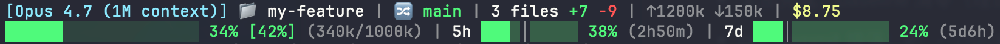

# claude-utils

Personal Claude Code extensions: worktree lifecycle hooks and a status band mod above the prompt (CLI and desktop app alike).

<p align="center">
  
</p>

> Small-scale personal tooling, but every "gotcha I hit" is packaged as a reusable component. Fork it, tweak it, file issues.
>
> **License**: MIT · [中文 README](README.zh.md)

## Install — 30 seconds, paste into Claude Code

Open Claude Code and paste this. Claude does the rest.

> Install claude-utils:
> 1. Run `git clone --depth 1 https://github.com/ericwu917/claude-utils.git ~/.claude/claude-utils`
> 2. Run `~/.claude/claude-utils/install.sh --all`
> 3. If the install script reports `Conflict` or `jq is required`, read `~/.claude/claude-utils/docs/SETTINGS_MERGE.md` and help me merge `~/.claude/settings.json` manually (create a timestamped backup first).
> 4. When install is done, tell me to start a new Claude Code session for the hooks and the mod to take effect.

### Or install manually

```bash
git clone --depth 1 https://github.com/ericwu917/claude-utils.git ~/.claude/claude-utils
~/.claude/claude-utils/install.sh --all         # default: hooks + mods
~/.claude/claude-utils/install.sh --hooks       # hooks only
~/.claude/claude-utils/install.sh --mods        # statusband mod only
~/.claude/claude-utils/install.sh --statusline  # legacy statusline.sh only (fallback, replaced by the mod)
~/.claude/claude-utils/install.sh --dry-run     # show what would be copied and the settings diff, don't write
```

- Requires `bash`, `jq`, `git`; the mod needs a Claude Code build with hooks modules (mods).
- `install.sh` **copies** the runtime into `~/.claude/` (`hooks/`, `mods/`, `statusline-refresh-caches.sh`) and points `settings.json` at the copies, never at the repo, so the runtime and the working tree stay independent (switching branches can't break a live session). To upgrade, `git pull` and rerun `install.sh`.
- Before writing, the script backs up your existing settings to `settings.json.bak.<timestamp>`.
- Idempotent: reruns only refresh changed files and claude-utils' own entries. If a slot already holds a non-claude-utils entry, the script warns and skips — **your config is never overwritten**. Other folders already in `CLAUDE_CODE_PLUGIN_DIRS` are kept; ours is appended.

## Components

### hooks/worktree-create.sh — `WorktreeCreate`

Prefix-driven base branch selection, plus a date stamp:

| Input `name` | Branch | Base |
|---|---|---|
| `feat/<rest>` | `feat/YYMMDD-<rest>` | `origin/develop` |
| `feature/<rest>` | `feature/YYMMDD-<rest>` | `origin/develop` |
| `hotfix/<rest>` | `hotfix/YYMMDD-<rest>` | `origin/master` |
| anything else | `worktree-<name>` | `origin/HEAD` (fallback) |

Example: `claude -w feat/kill-mutants-s2` → branch `feat/260418-kill-mutants-s2`, worktree at `<repo>/.claude/worktrees/feat/260418-kill-mutants-s2/`. If the expected base is missing (e.g. the repo has no `origin/develop`), the hook falls back to `origin/HEAD` — so it stays useful in projects that don't follow git-flow.

Local-scope MCP servers follow the worktree: local scope (`claude mcp add`'s default) is keyed by directory in `~/.claude.json`, so a worktree would otherwise start with none. The hook copies the parent repo's `projects["<repo>"].mcpServers` into the worktree's `.mcp.json` (merging into an existing untracked one; a tracked `.mcp.json` is left alone) and hides it via `info/exclude`. Project-scope servers need approval once per directory, i.e. per worktree — to skip that for servers you trust, list their names under `enabledMcpjsonServers` in `~/.claude/settings.json`.

### hooks/worktree-remove.sh — `WorktreeRemove`

Paired cleanup. Runs `git worktree remove` (**without `--force`**, so dirty worktrees are preserved) + `git branch -D` (**only if the branch's tip is already merged into `develop` / `master` / `main` or reachable from any remote ref**) + empty-parent-directory cleanup. Unmerged, unpushed branches are kept — `branch -D` is force-delete, so dropping a branch whose commits live only there would lose work. Re-invoking `claude -w <same-name>` later reattaches a worktree via the create hook's reuse path. Because CC invokes this hook with cwd set to the worktree being removed, every destructive git op is routed through `git -C "$MAIN_REPO"` — git refuses to self-delete its cwd or a checked-out branch, so the hook does the work from the main repo instead.

### mods/statusband — status band above the prompt

A Claude Code mod (a plugin of function hooks) that draws an `AbovePrompt` band, in the CLI and the desktop app alike, each surface its own way:

- **CLI**: two lines matching the old statusline.sh — `[model vX↑] 📁 dir | 🔀 branch | N files +a -d | 💾 hit% ⏳expiry | $session/$today/$month`, then context, 5h and 7d bars (a `┃` on 7d marks Fable's weekly usage). Bars are `Raster` rows: a solid track, a lighter same-hue elapsed-time band, a fill ending in a 1/8-width block (a 10-cell bar resolves 80 steps). Lines are fitted to the band's width without wrapping; a narrow terminal drops detail first (today/month, diff, countdowns…), never the bars.
- **Desktop app**: only what the app doesn't already show (directory, git, cache hit + expiry, cost, 5h/7d), with Svg bars and line icons; the `↗` after the directory opens it in Finder.

Color thresholds and the 7d work-hours pacing match the old statusline; work hours come from `STATUSLINE_WORK_START` / `STATUSLINE_WORK_END` (default 9–22), best set in `settings.json`'s `env` — the desktop app doesn't read your shell rc files. **Per-account data (5h/7d, Fable) always comes from the session's own account** (`$.session.usage()`, `$.session.authorize()` + `$.http.fetch`), never the keychain — the CLI and the app may be signed in as different accounts. Today/month cost comes from ccusage over every local JSONL (i.e. all accounts on the machine), its cache refreshed through `statusline-refresh-caches.sh ccusage`.

After a change, run `claude plugin validate mods/statusband` and `claude plugin test mods/statusband` (render tests on the terminal and desktop surfaces).

### statusline/statusline.sh — dual-line statusline (retired, fallback)

Replaced by the statusband mod above; `install.sh --statusline` still installs it (with its companion `hooks/last-reply.sh` Stop hook, which timestamps replies for the `⏱` segment). The slow-data refreshers (ccusage cost, Fable usage) live in `statusline/statusline-refresh-caches.sh`, whose ccusage half the mod reuses. Full details: [`statusline/README.md`](statusline/README.md).

## Architecture

| Location | Role |
|---|---|
| This repo | **Source**; `install.sh` copies the runtime out of it |
| `~/.claude/hooks/`, `~/.claude/mods/statusband/`, `~/.claude/statusline-refresh-caches.sh` | **Runtime** (copied by `install.sh`); `settings.json` references these |
| `~/.claude/settings.json` | CC's config; `install.sh` merges entries idempotently (hooks, `env.CLAUDE_CODE_PLUGIN_DIRS`) |
| `~/.claude/ccusage-cache.json` | today/month cost cache, shared by the mod and the legacy statusline |
| `~/.claude/worktree-hook.log` | stdin JSON of every worktree hook invocation — first stop when debugging |

```
claude-utils/
├── hooks/
│   ├── worktree-create.sh
│   ├── worktree-remove.sh
│   ├── worktree-lib.sh
│   ├── guard-worktree-edits.sh
│   └── last-reply.sh           # legacy statusline companion (fallback)
├── mods/
│   └── statusband/             # status band mod (hooks/register.tsx, types/, tests/)
├── statusline/
│   ├── statusline.sh           # retired, fallback
│   ├── statusline-refresh-caches.sh
│   └── README.md
├── docs/
│   └── SETTINGS_MERGE.md      # manual-merge guide for conflict cases
├── install.sh
├── CHANGELOG.md
├── LICENSE
├── CLAUDE.md                   # repo notes for Claude Code instances
└── README.md
```

## Pitfalls worth knowing before you write your own hooks

- **`WorktreeCreate` stdin**: the worktree name is at top-level `.name`, **not** `.tool_input.name`.
- **`WorktreeRemove` stdin**: the path field is `.worktree_path` (snake_case), not `.path` / `.worktreePath`.
- **`WorktreeRemove` cwd trap**: CC invokes the hook from inside the worktree being removed. `git worktree remove` and `git branch -D` both fail from that cwd because git refuses to self-delete its cwd or a checked-out branch. Use `git -C <main-repo>`.
- **Pairing requirement**: if you configure `WorktreeCreate`, you **must** also configure `WorktreeRemove`. CC's built-in cleanup does not run on `/exit` once a custom `WorktreeCreate` is set — even a clean worktree won't auto-remove. Undocumented but reproducible.

When writing a mod:

- **The CLI and the app can be different accounts**: the keychain token and `~/.claude.json` belong to the CLI's. Fetch per-account data with the session's own credential (the handle from `$.session.authorize()`, passed to `$.http.fetch`), or the app shows the CLI account's numbers.
- **Mods sit behind a rollout switch** (`tengu_plugin_hooks_modules`), cached in `~/.claude.json` and refreshed only when the CLI starts with network access; if `claude plugin test` says "hooks modules are turned off", start `claude` once and retry.
- **Don't give a desktop `Svg` `isInteractive`**: it moves into an iframe with a white background at a default 300×150; give `width` / `height` explicitly too.
- **On desktop only a `Button` takes clicks** (`Svg` and `Box` don't), and it always draws as a native button.
- **The blank row between the band and the prompt is the engine's own spacing**; a mod can't remove it.

## Roadmap

- [x] `install.sh` + paste-prompt one-shot install
- [x] English README
- [ ] `uninstall.sh` / `install.sh --update`
- [ ] shellcheck + shfmt CI

PRs and issues welcome.

## License

MIT — see [LICENSE](LICENSE).
