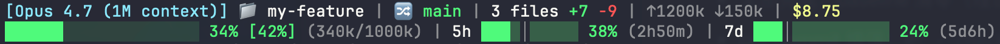

# Claude Code 自定义状态栏

自定义的 Claude Code 终端状态栏脚本，双行布局，实时显示工作环境和会话状态。

[English version](README.md)

## 效果预览

<p align="center">
  
</p>

## 布局说明

### 第一行 — 工作环境

| 字段 | 说明 |
|------|------|
| `[Opus 4.6 (1M context)]` | 当前模型 |
| `📁 project` | 项目目录名 |
| `🔀 master` | Git 分支 |
| `3 files +25 -10` | 未提交的文件变更（`git diff --shortstat HEAD`） |
| `💾 95%` | **最近一轮** API 调用的 prompt 缓存命中率 |
| `$0.50 / 4h10m / 1d2h` | 会话费用 **/** 累计 API 等待时间 **/** 墙钟时间。紧凑时长格式：`<24h` → `XhYm`，`≥24h` → `XdYh`（分钟精度；`5h`/`7d` 倒计时也走同一套格式化）。 |

### 第二行 — 配额状态

| 字段 | 说明 |
|------|------|
| `████░░░░ 35% (70k/200k)` | 上下文窗口用量（20 字符宽） |
| `5h ██░│░░░ 27% (3h12m)` | 5 小时滚动窗口用量（10 字符宽） |
| `7d ████░│░░░░░░ 30% (5d8h)` | 7 天窗口用量（14 字符宽） |

## 核心特性

### 速率限制进度条 + 时间标记

5h 和 7d 进度条上叠加了一条时间进度标记 `│`，可以直观判断消耗速率是否可持续：

```
用量 < 时间进度 → 绿色（可持续）
  5h ██│░░░░░░░ 27%

用量 > 时间进度 → 黄色/橙色（偏快）
  5h █████│░░░░ 60%

用量 >= 90% → 红色（高位警告）
  5h █████████│ 95%
```

颜色逻辑：
- **绿色** — 用量 <= 时间进度，消耗可持续
- **黄色** — 用量略超时间进度，或用量 < 50%（低位保护，防止窗口初期误报）
- **橙色** — 用量 > 时间进度 × 1.5
- **红色** — 用量 >= 90%（绝对高位）

### Prompt 缓存命中率

`💾 XX%` 显示**最近一次** API 调用里，多少比例的 input token 是从 prompt cache 读的：

```
命中率 = cache_read_input_tokens / (input_tokens + cache_creation_input_tokens + cache_read_input_tokens)
```

三个字段都在 `context_window.current_usage` 下。该对象在 session 首次 API 调用之前为 `null`，此时显示 `💾 --`。

由于 stdin 只给了 `current_usage`（没有累计缓存字段），这个百分比只反映**一轮**，不是会话累计。单轮偏低不用惊慌 —— **连续几轮偏低**才是信号。

阈值（按实际观测到的 CC 稳态校准；**Anthropic 官方不发布目标值**，只建议你按自己的 workload 监控）：

| 命中率 | 颜色 | 解读 |
|---|---|---|
| ≥ 95% | 🟢 绿 | 健康稳态（CC 长会话典型值） |
| 80–95% | 🟡 黄 | 正常波动 —— 本轮接收了大块新内容（读文件 / 大 tool 输出） |
| 50–80% | 🟠 橙 | 系统性在打 cache |
| < 50% | 🔴 红 | 首轮 / 刚 `/clear` / 空闲 >5min / cache 真的坏了 |

会打破 cache 的常见操作：session 中途改 `CLAUDE.md` / `settings.json` / hooks、装/卸 MCP server、切 model 或 permission mode、频繁 `/clear`、大量派 sub-agent（每个都是冷启动）、空闲超过 5 分钟（Anthropic 默认缓存 TTL）。

### 7d 活跃时间计算

7d 窗口的时间标记不按自然时间（168h）计算，而是只计算**工作时段**内的活跃时间：

- 默认工作时段：09:00 - 22:00（每天 13 小时）
- 7 天总活跃时间 ≈ 91 小时
- 精确到分钟级：逐日历日计算工作时段与窗口的重叠

这样时间标记更准确地反映了"在正常使用节奏下你应该消耗多少"。

### 非工作时间提醒

当前时间在工作时段外（默认 22:00-09:00）时，5h 和 7d 的**进度条和百分比强制显示红色**，提醒你正在非常规时段使用。

## 安装

### 前置依赖

- bash
- jq
- git（可选，用于显示分支和文件变更）
- macOS（`date -j -f` 用于时间计算）

### 配置

1. 复制脚本到 Claude Code 配置目录：

```bash
cp statusline.sh ~/.claude/statusline-command.sh
```

2. 在 `~/.claude/settings.json` 中配置状态栏：

```json
{
  "statusline": {
    "command": "bash ~/.claude/statusline-command.sh"
  }
}
```

### 环境变量

| 变量 | 默认值 | 说明 |
|------|--------|------|
| `STATUSLINE_WORK_START` | `9` | 工作时段开始（小时，0-23） |
| `STATUSLINE_WORK_END` | `22` | 工作时段结束（小时，0-23） |

示例：调整为 8:00-21:00 工作时段：

```bash
export STATUSLINE_WORK_START=8
export STATUSLINE_WORK_END=21
```

## 数据来源

所有数据来自 Claude Code 通过 stdin 传入的 JSON，主要字段：

| JSON 路径 | 用途 |
|-----------|------|
| `model.display_name` | 模型名称 |
| `workspace.current_dir` | 当前目录 |
| `context_window.used_percentage` | 上下文用量 |
| `context_window.context_window_size` | 上下文窗口大小 |
| `context_window.total_input_tokens` | 累计输入 token（默认不展示，在 `statusline.sh` 里取消注释 `↑${SEND_FMT} ↓${RECV_FMT}` 那行即可恢复） |
| `context_window.total_output_tokens` | 累计输出 token（同上） |
| `context_window.current_usage.input_tokens` | 最近一轮的非缓存输入（算缓存命中率用） |
| `context_window.current_usage.cache_creation_input_tokens` | 最近一轮写入缓存的 token |
| `context_window.current_usage.cache_read_input_tokens` | 最近一轮从缓存读的 token |
| `cost.total_cost_usd` | 会话费用（估算值；Pro/Max 订阅用户不代表实际账单） |
| `cost.total_api_duration_ms` | 本会话累计 API 等待时间 |
| `cost.total_duration_ms` | 会话墙钟时间 |
| `rate_limits.five_hour.*` | 5h 滚动窗口用量和重置时间 |
| `rate_limits.seven_day.*` | 7d 窗口用量和重置时间 |

> `rate_limits` 仅在 Claude.ai Pro/Max 订阅且首次 API 响应后可用。
